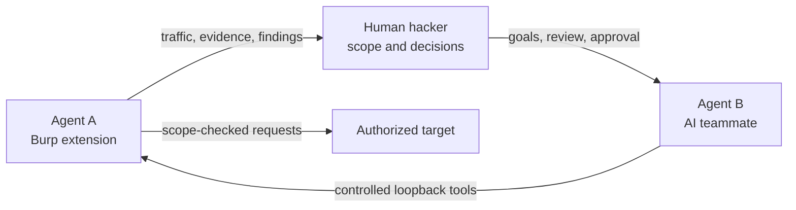
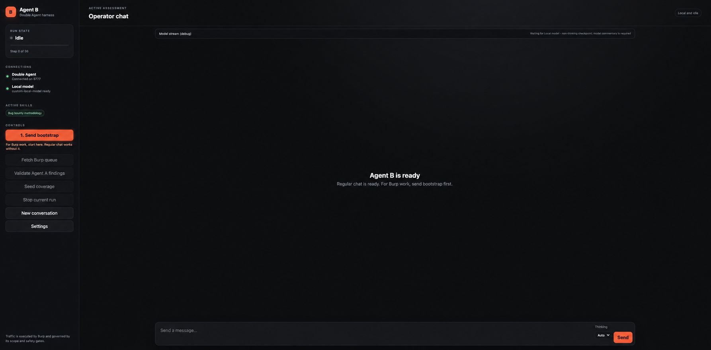
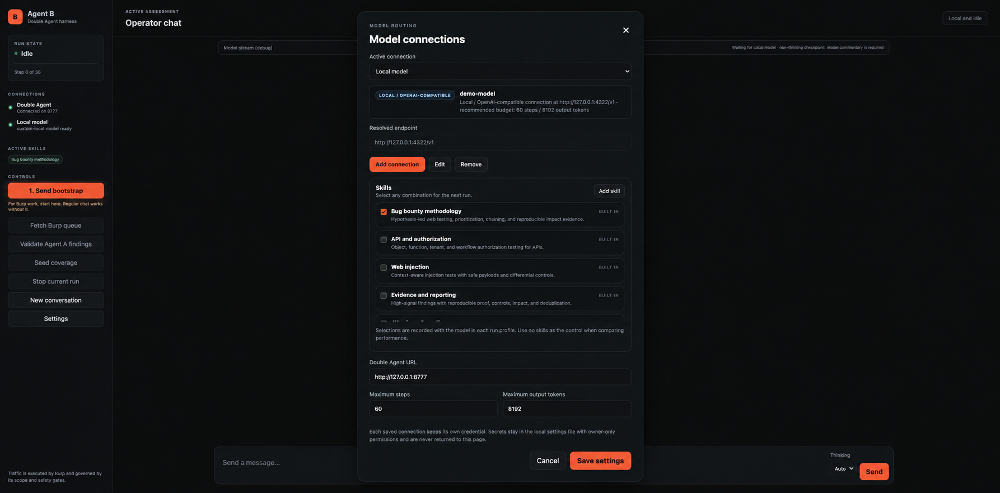

<p align="center">
  
</p>

<h1 align="center">DoubleAgent</h1>

<p align="center">
  <strong>Agent A in Burp. A human hacker in control. Agent B as the teammate.</strong>
</p>

<p align="center">
  
  
  
  
</p>

DoubleAgent is a two-part toolkit for authorized web security testing:

1. **Agent A — the Burp extension** sees proxy traffic, enforces scope, runs requests, and owns findings and evidence.
2. **The hacker — you** decides what is in scope, approves sensitive actions, and verifies the result.
3. **Agent B — the teammate** plans and reasons with your chosen model, then asks Agent A to perform controlled work through Burp.

> [!IMPORTANT]
> Use DoubleAgent only on systems you own or are explicitly authorized to test.

## How the team works



Agent B does not bypass Burp. Target traffic remains under Agent A's scope and safety controls, and the human operator remains responsible for every assessment.

## Quick start

### 1. Install Agent A in Burp

1. Download and extract the latest `DoubleAgent` release bundle.
2. Configure the Jython standalone 2.7.x JAR in **Burp → Extensions → Settings → Python Environment**.
3. Open **Extensions → Installed → Add**, choose **Python**, and select:

   ```text
   burp/DoubleAgent.py
   ```

4. Confirm the **Double Agent** tab appears, then start the Agent API.

That is the only extension file you select. The implementation under `burp/src/` is loaded automatically.

### 2. Start Agent B

Choose either route.

**Web interface — fastest from source**

```bash
cd agent_b
./run.command
```

Open [http://127.0.0.1:4310](http://127.0.0.1:4310).

**macOS application**

Download `Agent-B-macOS-v3.0.1.zip` from the latest release, extract it, and move **Agent B.app** to Applications. Maintainers and developers can build it with:

```bash
cd agent_b
./build-macos-app.sh
open "dist/Agent B.app"
```

### 3. Add your model

In Agent B, open **Settings → Add connection**. Supported connection types are:

- OpenAI
- Anthropic
- Amazon Bedrock
- Local/OpenAI-compatible servers such as Ollama, LM Studio, vLLM, oMLX, Splash, and llama.cpp

A fresh install contains no connection and no API key. Use **Test connection** before continuing.

### 4. Bring the team together

1. Confirm the authorized target and scope in Burp.
2. Start Agent A's API from the **Agent AI** tab.
3. In Agent B, select **Send bootstrap**.
4. Review the imported target and scope before asking Agent B to test anything.

The [Installation guide](https://github.com/sageoffensive/DoubleAgent/wiki/Installation) includes a complete walkthrough.

## Product tour

### Agent B workspace

Agent B opens as a normal, neutral chat. Burp context and assessment tools are loaded only when you explicitly select **Send bootstrap**.



### Bring your own model

Each connection keeps its own provider, endpoint, model ID, credential, and capabilities.



## Simple repository layout

```text
burp/
  DoubleAgent.py       # select this one file in Burp
  src/                 # internal Jython modules
agent_b/
  run.command          # launch the web interface
  build-macos-app.sh   # build Agent B.app
docs/wiki/             # plain-language guides
legacy/                # historical releases, not loaded by v3
```

The Burp implementation is split internally because large Jython modules can exceed JVM bytecode limits. Those chunks stay under `burp/src/` so users see one clear entry point without hiding the technical constraint.

## Security defaults

- Control services bind to loopback by default.
- Target traffic is executed through Burp and checked against Burp scope and safety gates.
- New Agent B conversations do not automatically load target context.
- Provider credentials are isolated per connection, stored locally with owner-only permissions, and omitted from API responses and transcripts.
- Assessment state, credentials, local databases, compiled output, and editor configuration are ignored by Git.
- A model's final message is not treated as proof: finding completion requires persisted, evidence-backed dispositions.

Read the [Security Model](https://github.com/sageoffensive/DoubleAgent/wiki/Security-Model) and report security issues privately through [SECURITY.md](SECURITY.md).

## Documentation

- [Wiki home](https://github.com/sageoffensive/DoubleAgent/wiki)
- [Installation](https://github.com/sageoffensive/DoubleAgent/wiki/Installation)
- [Configuration](https://github.com/sageoffensive/DoubleAgent/wiki/Configuration)
- [Architecture](https://github.com/sageoffensive/DoubleAgent/wiki/Architecture)
- [Operator workflows](https://github.com/sageoffensive/DoubleAgent/wiki/Operator-Workflows)
- [Troubleshooting](https://github.com/sageoffensive/DoubleAgent/wiki/Troubleshooting)
- [Contributing](CONTRIBUTING.md)

## Development

```bash
node --check agent_b/static/app.js
python3 -m unittest discover -s tests -v
(cd agent_b && python3 -m unittest discover -s tests -v)
```

DoubleAgent v3 is under active development. The roadmap prioritizes reliable evidence, duplicate review, provider interoperability, and reproducible evaluation.

## License

Released under the [MIT License](LICENSE).
