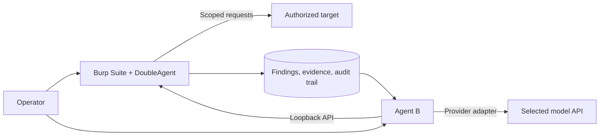

<p align="center">
  
</p>

<h1 align="center">DoubleAgent</h1>

<p align="center">
  Agentic web security testing with Burp Suite as the source of truth.
</p>

<p align="center">
  
  
  
  
</p>

DoubleAgent combines a Burp Suite extension with **Agent B**, a provider-neutral model harness. Burp owns scope, traffic, findings, evidence, approvals, and reporting. Agent B owns the model conversation and testing workflow. The model never receives a direct network path around Burp's controls.

> [!IMPORTANT]
> DoubleAgent is intended only for systems you own or are explicitly authorized to test.

## What v3.0 adds

- A modular Jython extension that stays below JVM bytecode limits.
- A dedicated Agent B desktop/web interface with explicit Burp bootstrap.
- Provider-aware connections for OpenAI, Anthropic, Amazon Bedrock, and local/OpenAI-compatible servers.
- No built-in model connections or developer endpoints on a fresh install.
- Per-connection credentials, owner-only settings, transcript redaction, and no secret fields in public settings responses.
- Evidence-backed finding validation, immutable finding IDs, optimistic version checks, and deterministic completion gates.
- Duplicate-review workflows for Agent A findings with auditable merge decisions.
- Native PortSwigger MCP discovery and tool transport over loopback.
- Selectable methodology skills, persistent run traces, and reproducible test contracts.

## Product tour

### Operator workspace

Agent B starts as a neutral chat. Burp context and assessment tools are loaded only when the operator selects **Send bootstrap**.


### Provider-neutral model routing

Connections are created explicitly and keep their own endpoint, model ID, credential, and capabilities.


## Architecture



The separation is deliberate:

- **DoubleAgent** is authoritative for target scope, requests, responses, findings, queue state, approvals, and report data.
- **Agent B** manages model connections, conversations, methodology, planning, and tool-call orchestration.
- **Model providers** see only the prompts and tool results required for the selected workflow. Credentials never cross between saved connections.

Read the [Security Model](docs/wiki/Security-Model.md) before connecting DoubleAgent to a real assessment.

## Install

### Requirements

- Burp Suite Professional or Community
- Jython standalone 2.7.x configured in Burp
- Python 3.10 or later for Agent B
- macOS 13 or later for the optional native Agent B application
- A model API connection you configure yourself

### 1. Install the Burp extension

1. Download and extract the `DoubleAgent-v3.0.0` release bundle.
2. Keep `double-agent-v3.0.py` and every sibling `double_agent_*.py` file together.
3. In Burp, open **Extensions → Installed → Add**.
4. Choose **Python** and select `double-agent-v3.0.py`.
5. Confirm the **Double Agent** tab appears.

If a loader does not expose the extension directory to Jython, set `DOUBLE_AGENT_EXTENSION_DIR` to the extracted folder before launching Burp.

### 2. Start Agent B

From source:

```bash
cd agent_b
./run.command
```

Then open `http://127.0.0.1:4310`.

On macOS, you can instead download the Agent B application from the release assets or build it locally:

```bash
cd agent_b
./build-macos-app.sh
open "dist/Agent B.app"
```

### 3. Add a model connection

Open **Settings → Add connection** and choose one of:

- **OpenAI** — hosted Chat Completions with bearer authentication.
- **Anthropic** — native Messages API with tool use.
- **Amazon Bedrock** — Converse API with a Bedrock bearer key.
- **Local / OpenAI-compatible** — Ollama, LM Studio, vLLM, oMLX, Splash, llama.cpp, and compatible servers.

Use **Test connection** before starting a run. A fresh installation contains no model connection and no API key.

### 4. Connect Burp

1. Start the DoubleAgent API from the **Agent AI** tab in Burp.
2. In Agent B, select **Send bootstrap**.
3. Confirm the connected target and scope before executing active tests.

See the [Installation](docs/wiki/Installation.md) and [Configuration](docs/wiki/Configuration.md) guides for a full walkthrough.

## Security defaults

- All control services bind to loopback by default.
- Target traffic is executed through Burp and checked against Burp's scope and safety gates.
- New Agent B conversations do not automatically load target context.
- Provider credentials are stored locally with owner-only permissions and omitted from API responses and transcripts.
- The repository ignores assessment state, credentials, local databases, compiled output, and editor configuration.
- Finding completion requires persisted, evidence-backed dispositions—not a model's prose claim.

Please report security issues privately using the process in [SECURITY.md](SECURITY.md).

## Development

Run the validation suite before opening a pull request:

```bash
node --check agent_b/static/app.js
python3 -m unittest discover -s tests -v
(cd agent_b && python3 -m unittest discover -s tests -v)
```

Build and verify the macOS application:

```bash
cd agent_b
./build-macos-app.sh
codesign --verify --deep --strict "dist/Agent B.app"
```

Contributions are welcome. Start with [CONTRIBUTING.md](CONTRIBUTING.md) and the [documentation hub](docs/wiki/Home.md).

## Project status

DoubleAgent v3.0 is an active security tool. Treat model output as untrusted, keep a human operator in the loop, and preserve Burp's scope controls. The roadmap prioritizes reliable evidence, finding deduplication, provider interoperability, and reproducible evaluation.

## License

Released under the [MIT License](LICENSE).
