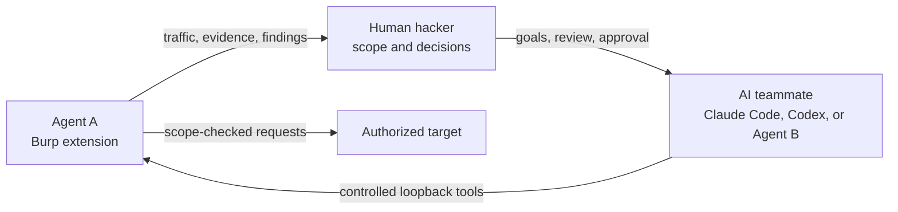

<p align="center">
  
</p>

<h1 align="center">DoubleAgent</h1>

<p align="center">
  <strong>Agentic speed. Human authority.</strong><br>
  A safer, guided way to use AI in web security testing.
</p>

<p align="center">
  
  
  
  
  
</p>

Security teams want the speed of agentic testing. Clients need confidence that an AI cannot quietly leave scope, take unreviewed action, or declare success without evidence.

**DoubleAgent is built for that gap.** It separates reasoning from authority:

1. **Agent A — the Burp extension** enforces scope, runs target requests, and owns findings and evidence.
2. **The human hacker — the authority** sets the objective, reviews evidence, answers questions, and approves sensitive decisions.
3. **The AI teammate — Claude Code, Codex, or Agent B** plans and reasons, then uses Agent A's generated prompt and controlled interface to work with Burp.

The model assists the tester. It does not become the tester's authority.

> [!IMPORTANT]
> Use DoubleAgent only on systems you own or are explicitly authorized to test.

> [!NOTE]
> Agent B's web interface and macOS app are **experimental works in progress**. You do not need either harness to use DoubleAgent: Agent A generates activation and resume prompts that you can paste directly into a fresh Claude Code or Codex session. The dedicated harnesses are included for testing, contribution, and development toward a more focused security-agent experience.

## Safer by architecture, not by promise

No AI system is risk-free. DoubleAgent reduces runaway-agent risk by limiting what the model can control and keeping consequential decisions with Burp and the operator.

| Client concern | DoubleAgent control |
| --- | --- |
| “What if the agent leaves scope?” | Agent A executes target traffic through Burp and applies Burp's configured scope and safety gates. |
| “What if the model acts directly?” | Agent B has no separate target-network path; it requests allowlisted actions from Agent A over loopback. |
| “What if it takes a disruptive action?” | State-changing and sensitive workflows pass through deterministic gates and pause for human input where required. |
| “What if it says the test is complete when it is not?” | Completion depends on persisted findings, evidence, dispositions, and authoritative read-back—not the model's prose. |
| “What if target content manipulates the agent?” | Model output, target content, and imported methodology are treated as untrusted input and cannot override scope or tool contracts. |
| “What if credentials cross providers?” | Each model connection owns its credential; secrets are stored locally, isolated per connection, and redacted from public responses and transcripts. |

This is a **human-in-the-loop control system**, not an unsupervised autonomous scanner. Read [Why human-in-the-loop](https://github.com/sageoffensive/DoubleAgent/wiki/Why-Human-In-The-Loop) for the client-facing risk model.

## How the team works



The Agent B harness has no separate target-network path. Claude Code and Codex users receive the same Agent A operating contract through the generated prompt, while retaining the permissions of their general-purpose runtime. The human operator remains responsible for authorization, intensity, approvals, and final judgment.

## Claude Code, Codex, or the Agent B harness?

**Claude Code and Codex are supported ways to operate DoubleAgent today.** Agent A contains a generated activation prompt and a separate resume prompt tailored to the running Burp workspace. Paste one into a fresh agent session and it directs the agent to load DoubleAgent's current API documentation, Burp skill, capabilities, workspace, scope, preflight checks, queue, findings, and evidence rules. The detailed operating knowledge comes from Agent A at runtime, so users do not need to install a separate prompt pack or agent skill folder.

The included Agent B web and macOS harnesses explore what a purpose-built security-agent experience can add on top of the same Agent A control plane. They are **works in progress**, not a claim that users must replace Claude Code or Codex. The model supplies intelligence; the custom harness aims to keep that intelligence focused on the authorized assessment and make the workflow more repeatable.

| Assessment need | Experimental Agent B harness | Claude Code or Codex with the DoubleAgent prompt |
| --- | --- | --- |
| Keep the model focused | Loads an explicit assessment contract, selected security skills, current target state, plan, and relevant evidence. Long histories are compacted into assessment checkpoints instead of becoming an unstructured conversation. | The generated prompt provides a strong initial anchor and live state, while continued focus also depends on the general session context and operator. |
| Limit authority | Exposes a small allowlisted security tool surface. The model does not receive a general shell, arbitrary file access, or a separate route to the target. | The agent retains the capabilities allowed by its normal runtime. The prompt tells it to use DoubleAgent for target work, but it is not a sandbox; configure the agent's own approvals and permissions appropriately. |
| Enforce scope | Routes target traffic through Agent A and Burp, where scope, safety, transport, and confirmation rules are authoritative. | Agent A enforces every action requested through its API. Other shell, network, or MCP capabilities remain governed by the Claude Code or Codex runtime and operator configuration. |
| Demand evidence | Adds controller-level completion checks around Agent A's captured requests, responses, finding linkage, persisted dispositions, and authoritative read-back. | The generated prompt instructs the agent to use those evidence APIs and verify writes; the operator also has the general agent's native transcript and controls. |
| Maintain assessment discipline | Uses phase control, stable tool schemas, bounded step budgets, duplicate-call guards, queue ownership, coverage tracking, and completion gates. | The generated prompt loads the workflow and current state, while sequencing remains more dependent on the agent session and operator than on a dedicated controller. |
| Preserve human judgment | Pauses for questions and approvals, shows live model activity, and keeps the hacker responsible for authorization and final judgment. | Claude Code and Codex provide their own human controls; the generated prompt identifies DoubleAgent's approval points, and Agent A enforces gated actions. |
| Compare models fairly | Runs OpenAI, Anthropic, Bedrock, and local/OpenAI-compatible models behind the same contracts and tools, making model and methodology comparisons more reproducible. | Different agents bring different prompts, tools, context policies, and execution environments, which can confound model comparisons. |
| Recover and audit | Records local run events, checkpoints assessment progress, protects finding state, and resumes through a domain-specific workflow rather than relying only on chat history. | Agent A still persists findings, evidence, coverage, and queues; **Copy Resume Prompt** rehydrates that state into a new general-agent session. |

A custom harness also reduces **context drift**. Agent B repeatedly anchors the model to the target, current test phase, outstanding evidence, and permitted next actions. It can reject a structurally invalid action even when the model sounds confident. These controls are deterministic harness behaviour, not another instruction the model may forget.

Until the web and macOS harnesses mature, Claude Code or Codex with Agent A's generated prompt is the simplest route for most users. In either route, actions sent through DoubleAgent stay under Agent A and Burp's scope, findings, and evidence controls; the custom harness additionally removes the model's separate general-computer path.

## Quick start

### 1. Install Agent A in Burp

1. Download and extract the latest `DoubleAgent` release bundle.
2. Configure the Jython standalone 2.7.x JAR in **Burp → Extensions → Settings → Python Environment**.
3. Open **Extensions → Installed → Add**, choose **Python**, and select:

   ```text
   burp/DoubleAgent.py
   ```

4. Confirm the **Double Agent** tab appears, then start the Agent API.

That is the only extension file you select. The implementation under `burp/src/` is loaded automatically.

### 2. Enable PortSwigger MCP

Install **MCP Server** from Burp's BApp Store, open the **MCP** tab, and enable its loopback listener on `127.0.0.1:9876`. Agent A brokers this connection; Agent B does not connect to MCP directly or require a Claude Desktop/stdio configuration.

MCP is required for full Burp-native capability, including HTTP/2-sensitive execution. Read the [PortSwigger MCP guide](https://github.com/sageoffensive/DoubleAgent/wiki/PortSwigger-MCP) for setup, verification, fallbacks and security gates.

### 3. Choose how to run the agent

**Claude Code or Codex — simplest starting route**

1. In Burp's **Agent AI** tab, select **Start Server**.
2. Select **Copy Agent B's Prompt** and paste it into a fresh Claude Code or Codex session.
3. Let the agent run the prompt's local readiness checks, then review its reported target, scope, and available Burp capabilities.
4. When continuing after a restart or a long break, use **Copy Resume Prompt** instead so the agent reloads persisted findings, coverage, knowledge, fixtures, confirmations, and queued work.

You can also print the current activation prompt from the loopback API:

```bash
curl -s http://127.0.0.1:8777/api/agent/prompt | jq -r .prompt
```

The prompt contains no API key. It points the agent at Agent A's loopback-only, self-describing API and tells it to fetch the current Burp operating skill and workspace state before acting. Because Claude Code and Codex remain general-purpose agents, review their normal shell, network, approval, and MCP permissions separately.

**Agent B web interface — experimental work in progress**

```bash
cd agent_b
./run.command
```

Open [http://127.0.0.1:4310](http://127.0.0.1:4310).

**Agent B macOS application — experimental work in progress**

Download `Agent-B-macOS-v3.0.1.zip` from the latest release, extract it, and move **Agent B.app** to Applications. Maintainers and developers can build it with:

```bash
cd agent_b
./build-macos-app.sh
open "dist/Agent B.app"
```

### 4. If using Agent B, add your model

Skip this step when using Claude Code or Codex. In the experimental Agent B harness, open **Settings → Add connection**. Supported connection types are:

- OpenAI
- Anthropic
- Amazon Bedrock
- Local/OpenAI-compatible servers such as Ollama, LM Studio, vLLM, oMLX, Splash, and llama.cpp

A fresh install contains no connection and no API key. Use **Test connection** before continuing.

### 5. Start the assessment

1. Confirm the authorized target and scope in Burp.
2. Start Agent A's API from the **Agent AI** tab.
3. Paste **Copy Agent B's Prompt** into Claude Code or Codex, or select **Send bootstrap** in the Agent B harness.
4. Review the imported target, scope, capabilities, and safety state before asking the agent to test anything.

The [Installation guide](https://github.com/sageoffensive/DoubleAgent/wiki/Installation) includes a complete walkthrough.

## Product tour

### Agent B workspace (work in progress)

The experimental Agent B harness opens as a normal, neutral chat. Burp context and assessment tools are loaded only when you explicitly select **Send bootstrap**.


### Bring your own model

Each connection keeps its own provider, endpoint, model ID, credential, and capabilities.


## Simple repository layout

```text
burp/
  DoubleAgent.py       # select this one file in Burp
  src/                 # internal Jython modules
agent_b/
  run.command          # launch the web interface
  build-macos-app.sh   # build Agent B.app
docs/wiki/             # plain-language guides
```

The Burp implementation is split internally because large Jython modules can exceed JVM bytecode limits. Those chunks stay under `burp/src/` so users see one clear entry point without hiding the technical constraint.

## Security defaults

- Control services bind to loopback by default.
- Target traffic is executed through Burp and checked against Burp scope and safety gates.
- New Agent B conversations do not automatically load target context.
- Provider credentials are isolated per connection, stored locally with owner-only permissions, and omitted from API responses and transcripts.
- Assessment state, credentials, local databases, compiled output, and editor configuration are ignored by Git.
- A model's final message is not treated as proof: finding completion requires persisted, evidence-backed dispositions.

Read the [Security Model](https://github.com/sageoffensive/DoubleAgent/wiki/Security-Model) and report security issues privately through [SECURITY.md](SECURITY.md).

## Documentation

- [Wiki home](https://github.com/sageoffensive/DoubleAgent/wiki)
- [Installation](https://github.com/sageoffensive/DoubleAgent/wiki/Installation)
- [Configuration](https://github.com/sageoffensive/DoubleAgent/wiki/Configuration)
- [Architecture](https://github.com/sageoffensive/DoubleAgent/wiki/Architecture)
- [PortSwigger MCP](https://github.com/sageoffensive/DoubleAgent/wiki/PortSwigger-MCP)
- [Why human-in-the-loop](https://github.com/sageoffensive/DoubleAgent/wiki/Why-Human-In-The-Loop)
- [Operator workflows](https://github.com/sageoffensive/DoubleAgent/wiki/Operator-Workflows)
- [Troubleshooting](https://github.com/sageoffensive/DoubleAgent/wiki/Troubleshooting)
- [Contributing](CONTRIBUTING.md)

## Development

```bash
node --check agent_b/static/app.js
python3 -m unittest discover -s tests -v
(cd agent_b && python3 -m unittest discover -s tests -v)
```

DoubleAgent v3 is under active development. The roadmap prioritizes reliable evidence, duplicate review, provider interoperability, and reproducible evaluation.

## License

Released under the [MIT License](LICENSE).
