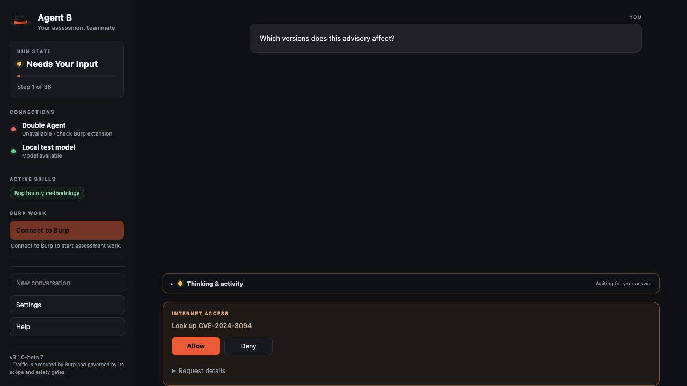

# DoubleAgent 3.1.0 beta 7

Agent B now asks for your permission before fetching supported public reference data. A compact **Allow / Deny** card replaces **Review together**, making the next internet request visible and keeping the decision with you.

## New security feature: one-time internet permission

- **See the request before it runs.** A short summary describes the lookup. Expand **Request details**, collapsed by default, to see the destination, exactly which identifiers or file paths will be sent, what will be fetched, why the model needs it, and which configured model receives the result.
- **Allow once or Deny.** No reference retrieval starts before Allow. Permission binds to the immutable request shown in the card. Each additional lookup requires a new choice. Deny prevents automatic retries for the rest of the chat turn.
- **The harness enforces the decision.** Models cannot approve themselves or use approval flags, uploaded-file instructions, retrieved content or earlier conversational intent as consent. Stop and app restart cancel pending permission; stale answers cannot be replayed. Stop cannot recall data already sent.
- **Destinations remain bounded.** Supported references are published OSV advisories, exact package/version advisory matches, and up to six selected public GitHub source/text files at an explicit revision. GitHub retrieval resolves the approved revision to one commit. Arbitrary URLs, redirects, crawling, credentials, cookies, inherited proxies, repository cloning and file execution remain unavailable.
- **Scope stays authoritative.** Reference proposals are available only in regular chat. They cannot run assessment tools, send target traffic, change scope or create findings. Burp's existing scope and safety gates remain enforced.

This controls model-initiated public-reference retrieval, not every network call made by the app. Normal chat still uses its configured model connection; Burp assessment traffic retains its existing controls. Retrieved text is untrusted reference material, and an advisory or static match is not a verified vulnerability.

## Simpler chat

- Removed the Review together button, offers, panel and script. The old research launch endpoints return HTTP 410, including requests carrying old consent flags.
- Pending internet requests appear once, with Allow/Deny and collapsed details. Requests and the operator's choices remain visible in the chat history after the decision.
- Existing research notes and read-only historical exports are preserved. Settings, saved connections and chat history are preserved by the installed-app update.
- Help now explains internet permission. No extra mode or sharing checkbox is needed.
- Displayed version **v3.1.0-beta.7**; Mac bundle build **3107**. Burp's version label is updated; this release adds no new Burp testing behavior.

## Downloads

- `Agent-B-macOS-arm64-v3.1.0-beta.7.zip`: signed, notarized and stapled Apple Silicon app with bundled Python.
- `DoubleAgent-Burp-v3.1.0-beta.7.zip`: Burp extension and modular source.
- `DoubleAgent-v3.1.0-beta.7.zip`: reviewed source and documentation for both agents.
- `SHA256SUMS`: archive checksums.

## Verification and remaining limits

- 226 Agent B tests and 48 extension tests pass with the bundled Python 3.12 runtime. Permission regressions verify no retrieval before Allow, Deny blocking retries, fresh consent per lookup, Stop/restart cancellation, strict Allow/Deny answers, rejected model-supplied consent flags, immutable approved inputs, selected-file retrieval and absence of assessment tools in chat.
- JavaScript syntax and permission-card rendering checks pass. Isolated UI checks exercise Allow, Deny and Stop, verify collapsed details, a single pending card, preserved expansion across polling, narrow-window usability and no browser errors. Lookup transport was mocked; these tests sent no live reference or target requests and ran no scanners.
- The exact app passes strict signature verification, Apple notarization, stapling, ticket validation and Gatekeeper. Its isolated runtime smoke check verifies startup, empty settings, UI, notes/export, local uploads/downloads, removal of the old research endpoint, and offline JavaScript reports. Bundled harness/UI files match the release source byte for byte.
- Exact staged source and final app secret scans are clean. Release archives have published SHA-256 checksums.

This remains a **prerelease**, tested on Apple Silicon with macOS 27.2. A quarantined installation on a clean Mac, Intel and minimum-supported-macOS testing remain outstanding. See [the macOS release checklist](macos-release.md) and [internet permission guide](wiki/Research.md).
