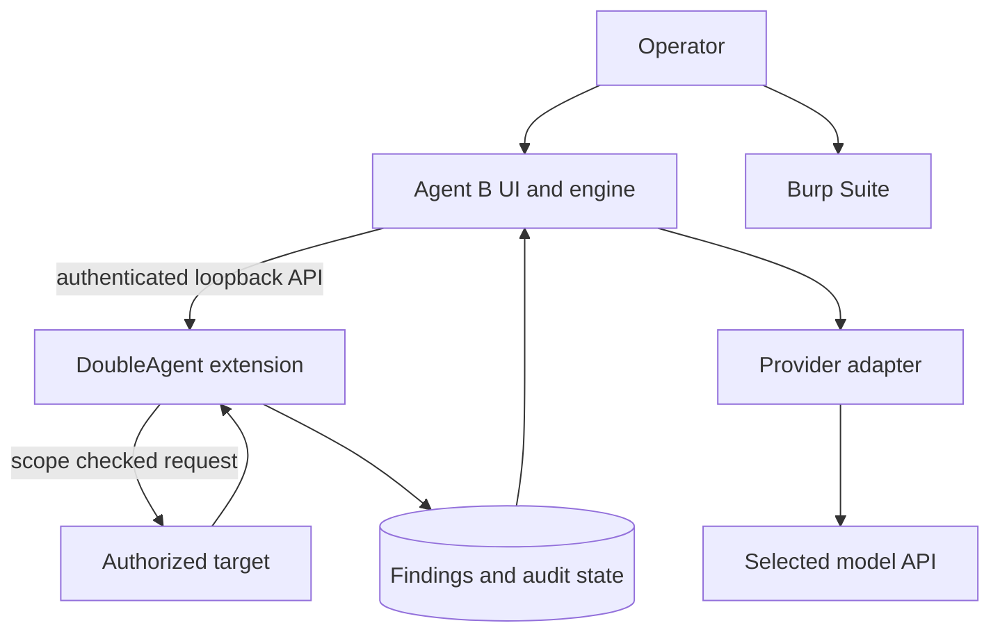

# Architecture

## DoubleAgent extension

The Jython extension owns:

- Burp scope and proxy traffic;
- request execution and safety checks;
- findings, versions, evidence, and audit records;
- work queues and assessment state;
- reporting and PortSwigger MCP transport.

The v3.0 implementation is split across sibling Python modules to avoid JVM bytecode limits. The entry point reloads those modules when Burp reloads the extension.

## Agent B

Agent B owns:

- the operator chat interface;
- provider-specific request translation;
- run contracts, phase control, and methodology selection;
- duplicate-call prevention and evidence policy;
- human questions and approval pauses;
- local run traces and lessons.

Agent B does not replace Burp's authority. It calls an allowlisted subset of DoubleAgent's loopback API.

## Provider adapters

Agent B supports:

- OpenAI Chat Completions;
- Anthropic Messages;
- Amazon Bedrock Converse;
- OpenAI-compatible `/models` and `/chat/completions` servers.

Tool schemas are translated at the provider boundary while the internal workflow remains provider-neutral.

## Finding lifecycle

Findings use immutable `daf_...` identifiers and versioned updates. A completed assessment requires persisted dispositions for linked findings. The harness does not accept an unverified model statement that work is complete.
