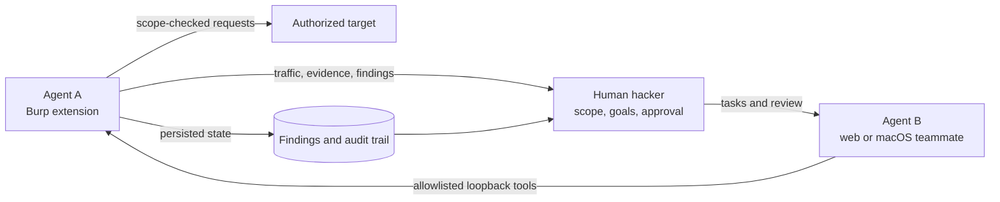

# Architecture

The simplest way to understand DoubleAgent is:

**Agent A gathers and controls → the hacker decides → Agent B assists**

The architecture intentionally separates **reasoning** from **authority**. Agent B can propose work; Agent A and the human operator control whether and how that work becomes target traffic or persisted security state.

## Agent A: authority inside Burp

Agent A owns:

- Burp scope and proxy traffic;
- request execution and safety checks;
- findings, versions, evidence, and audit records;
- work queues and assessment state;
- reporting and PortSwigger MCP transport.

Burp loads one public entry point: `burp/DoubleAgent.py`. The implementation under `burp/src/` remains split into smaller modules because Jython compiles to JVM bytecode and very large modules can exceed the JVM method-size limit.

## The human hacker: control plane

The operator owns:

- authorization and target scope;
- the testing objective;
- approvals and answers to questions;
- evidence review and final judgment;
- confirmation that actions and findings were actually persisted.

DoubleAgent is a teammate system, not an autonomous authority.

## Agent B: reasoning teammate

Agent B owns:

- the browser and macOS chat interface;
- model-provider translation;
- run contracts, phase control, and methodology selection;
- duplicate-call prevention and evidence policy;
- human questions and approval pauses;
- local run traces and lessons.

Agent B calls an allowlisted subset of Agent A's loopback API. It does not replace Burp's scope controls and has no separate target-network path.

## Model providers

Agent B supports OpenAI, Anthropic, Amazon Bedrock, and local/OpenAI-compatible servers. Each saved connection owns its own endpoint, exact model ID, credential, and capabilities. Credentials are isolated at the provider boundary.

## Finding lifecycle

Findings use immutable `daf_...` identifiers and versioned updates. A completed assessment requires persisted dispositions and evidence. A model saying “done” is not proof that the work was saved.
