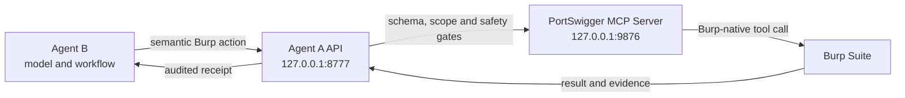

# PortSwigger MCP integration

PortSwigger MCP gives Agent A access to Burp-native tools that are not available through the legacy extension callbacks alone. It is required for full DoubleAgent operation, including HTTP/2 and pseudo-header-sensitive requests.

Agent B does **not** connect directly to the MCP server. Agent A is the broker and remains the authority for scope, safety and execution.



## What MCP adds

Agent A discovers the tools exposed by PortSwigger's MCP Server extension and turns supported tools into stable, semantic actions for Agent B. Depending on the Burp edition and MCP Server version, these may include:

- HTTP/1.1 and HTTP/2 requests;
- Proxy and WebSocket history access;
- Repeater and Intruder actions;
- Collaborator payloads and interactions in Burp Professional;
- Organizer and other Burp workspace operations;
- configuration and task controls when the operator enables them.

DoubleAgent prefers semantic actions such as `request.send.http2` over raw MCP tool names. This lets Agent A apply the same policy even if PortSwigger changes an underlying tool name or schema.

## Install the MCP Server extension

1. In Burp, open **Extensions → BApp Store**.
2. Find and install **MCP Server** by PortSwigger. It supports Burp Suite Professional and Community.
3. Open the new **MCP** tab.
4. Enable the MCP server.
5. Keep it bound to `127.0.0.1` and use port `9876`, unless you have a specific local conflict.
6. Review the MCP extension's target approval settings. Leave configuration-editing tools disabled unless your workflow explicitly needs them.

The official listing is [MCP Server in the BApp Store](https://portswigger.net/bappstore/9952290f04ed4f628e624d0aa9dccebc), and its source is available from [PortSwigger/mcp-server](https://github.com/PortSwigger/mcp-server).

> DoubleAgent connects directly to the local SSE endpoint. Do not install or configure the packaged stdio proxy, Claude Desktop integration, or another MCP client for Agent B.

## Configure a different endpoint

Agent A uses this endpoint by default:

```text
http://127.0.0.1:9876/
```

To use another local port, set `PORTSWIGGER_MCP_URL` before starting Burp:

```bash
export PORTSWIGGER_MCP_URL="http://127.0.0.1:9988/"
```

Keep the endpoint on loopback. Do not expose the MCP server or Agent A API to a LAN or public interface.

## Verify the connection

First, confirm that the MCP SSE listener responds:

```bash
curl --max-time 2 -N -i http://127.0.0.1:9876/
```

A working listener returns an event-stream response containing an `endpoint` event. The two-second timeout is expected because SSE connections normally remain open.

With Agent A's API running, request a bounded capability refresh:

```bash
curl -s "http://127.0.0.1:8777/api/agent/mcp/capabilities?refresh=true"
```

The refresh runs asynchronously. Repeat the request without `refresh=true`, then inspect the merged Burp action catalog:

```bash
curl -s http://127.0.0.1:8777/api/agent/mcp/capabilities
curl -s http://127.0.0.1:8777/api/agent/burp/capabilities
```

The MCP response should report discovered tools. The Burp capabilities response distinguishes MCP-backed actions from Agent A callback fallbacks.

## How an Agent B action is controlled

1. Agent B selects a semantic action advertised by Agent A.
2. Agent B's harness permits only approved local DoubleAgent API paths. Active actions require a claimed work item.
3. Agent A maps the semantic action to a tool actually discovered from PortSwigger MCP.
4. Agent A validates required arguments and extracts the target, method and action classification.
5. Burp scope and DoubleAgent's safety gate are checked before target traffic is allowed.
6. Sensitive, destructive or uncertain actions pause for confirmation.
7. Active actions require an audit note describing the work item, purpose and expected result.
8. Agent A executes the MCP tool and returns an execution receipt to Agent B.

Raw calls through `/api/agent/mcp/call` are supported for discovered capabilities without a semantic mapping, but they pass through the same schema, scope, safety and confirmation gates. Semantic actions are preferred.

## MCP and fallback behavior

| Capability | When MCP is unavailable |
| --- | --- |
| Ordinary HTTP/1.1 request through Burp | Agent A can use its normal request path. |
| Create a Repeater proof-of-concept tab | Agent A can use the Burp extension callback when available. |
| Start an active Scanner job | Agent A can use the Burp callback in editions that provide Scanner. |
| Collaborator operations | Callback support may be available in Burp Professional. |
| HTTP/2 or pseudo-header-sensitive execution | MCP is required; DoubleAgent must not silently downgrade the test to HTTP/1.1. |
| A Burp-native action with no callback fallback | The action remains unavailable until MCP exposes it or the operator performs it manually. |

Agent B should mark required work as gated or blocked when the necessary transport is unavailable. It must not claim that an MCP action ran when it did not.

## Security notes

- Keep both local services on loopback: Agent A on `127.0.0.1:8777` and PortSwigger MCP on `127.0.0.1:9876`.
- MCP control traffic goes directly over loopback and must not be sent through Burp's assessment proxy.
- Target traffic still runs through Burp and remains subject to Burp scope and DoubleAgent safety gates.
- Enabling a tool in the MCP extension does not automatically authorize Agent B to use it.
- Burp edition and extension version determine which tools are exposed. Never assume a capability exists; inspect the advertised catalog.

Continue with [Operator Workflows](Operator-Workflows.md), or use [Troubleshooting](Troubleshooting.md) if tool discovery remains degraded.
